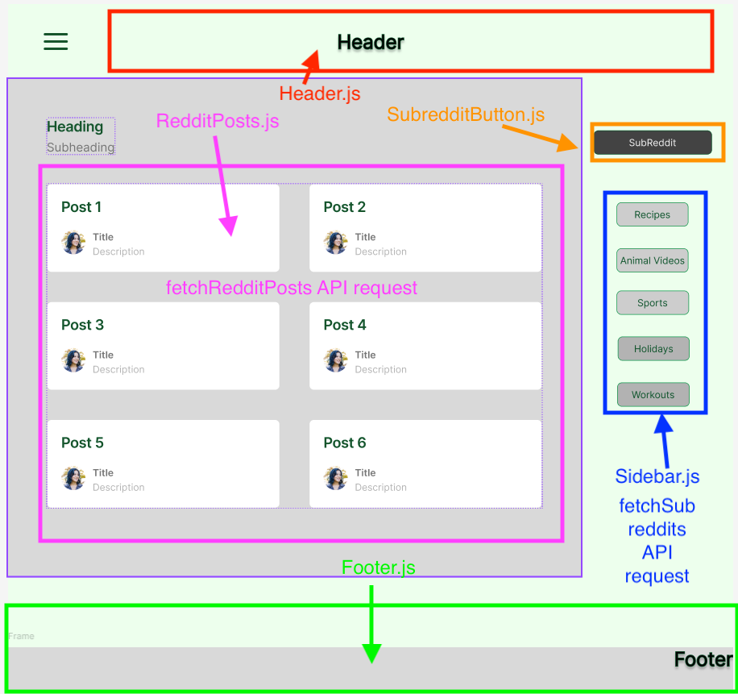

### Reddit Example for KM

This is an example project to help one of my students with how to structure a React application based on a wireframe.

The chosen source of data is the Reddit API, which will be used to get a list of subreddits and then posts within that subreddit.

The aim of this project is to provide basic examples of various concepts such as:

- **Component-based architecture**: Breaking down the UI into reusable components.
- **State management**: Using React hooks like `useState` and `useEffect` to manage state.
- **API integration**: Making asynchronous API requests to fetch data, showing the basic request - response pattern.
- **Event handling**: Handling user interactions such as button clicks.
- **Error handling**: Handling errors returned from API queries.

There is no styling of the front end, it is all about handling data within the React component based architecture model.

## Wireframe

I have made some notes on the initial wireframe to give an idea of how I started to split the page up conceptually in terms of:

- **Components**
- **Data (API requests)**

## Project Structure

- **api/redditApi.js**: Contains functions for making API requests to Reddit.
- **components/Footer.js**: The footer component.
- **components/Header.js**: The header component.
- **components/RedditPosts.js**: Component to display posts from a selected subreddit. Uses `fetchRedditPosts` from the API file, passes in the subreddit from the SubredditButton component.
- **components/Sidebar.js**: Component to display a list of subreddits. Uses `fetchSubreddits` to get a set amount of subreddits.
- **components/SubredditButton.js**: Component representing each subreddit button in the sidebar. Stores the chosen subreddit which is used by the RedditPosts component to request the posts for the subreddit from the API.
- **App.js**: Main application component that includes layout and renders other components, like my wireframe notes.
- **App.css**: Contains styles for the application.
- **index.js**: Entry point for the React application.

## Next Steps

Run the project locally by cloning it, installing packages and running the React server.

Have a good read through the code and compare it to my notes on this README, try tinker with it to understand the concepts more, I hope it helps.

